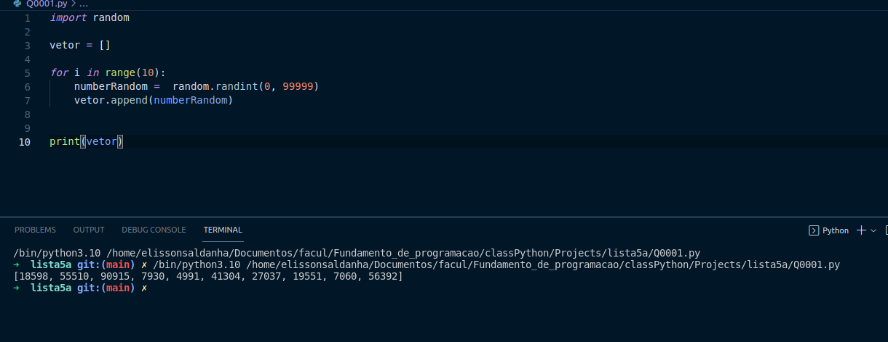
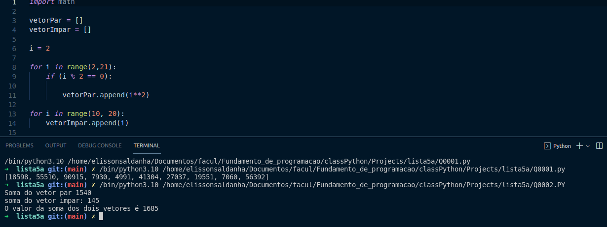
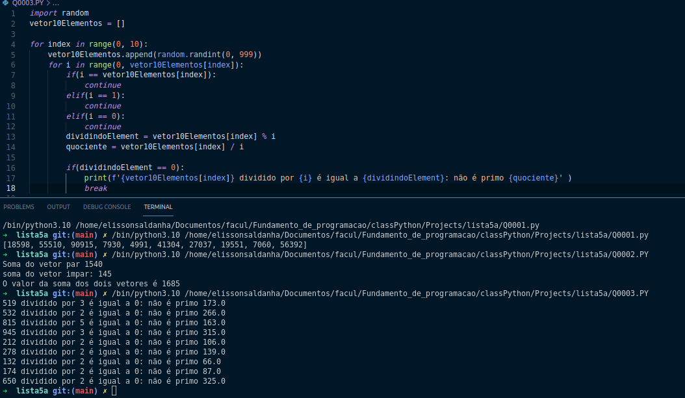
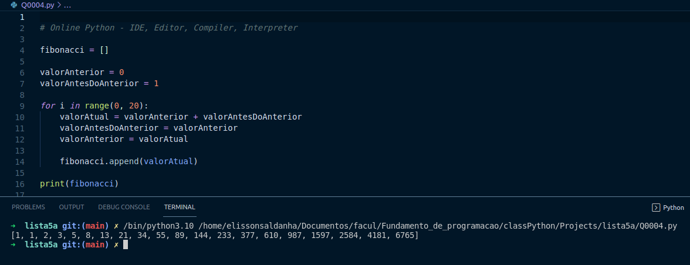
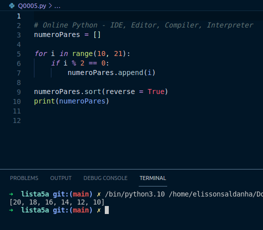
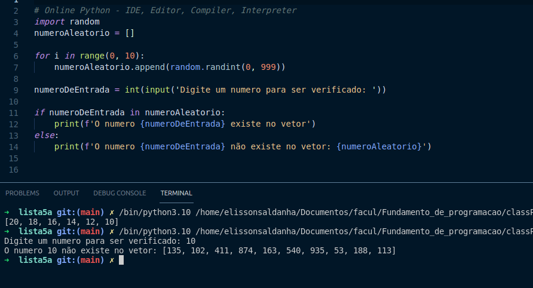
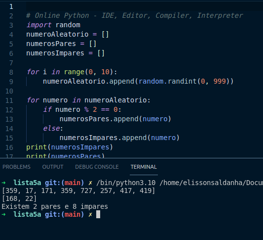
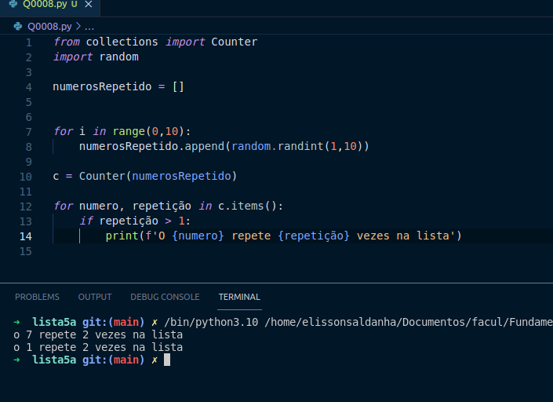

# Lista 05 do Curso Ciências da Computação 
## Disciplina: Fundamentos da Programação

* **(1° questão)** 
**Gerar um vetor aleatório de 10 posições, em seguida ordená-lo de forma crescente
e, depois, decrescente.**

* **(2° questão) Preencher um primeiro vetor com o quadrado dos números pares do intervalo 2 a
Preencher um segundo vetor com os números de 10 a 19. Mostrar a soma dos
dois vetores.**

* **(3° questão)Gerar um vetor de 10 elementos. Em seguida, verifique quantos números primos
existem no vetor, imprimindo-os.**

* **(4° questão) Crie um vetor de inteiros para armazenar a sequência Fibonacci até a 20a. posição**

* **(5° questão) Preencher um vetor com os números 10 a 20, e depois mostrar os elementos pares
do vetor de trás para frente**

* **(6° questão)Gerar/Cria um vetor de 10 posições, randomicamente, depois ler um valor e
verificar se esse valor está ou não no vetor gerado, mostrando a sua posição;**

* **(7° questão) Gerar/Cria um vetor de 10 posições, randomicamente, depois contar quantos pares
e quantos ímpares existem no vetor;**

* **(8° questão)Gerar/Cria um vetor de 10 posições, randomicamente, depois contar quantos
valores repetidos existem no vetor gerado, imprimindo-os se houver;**

